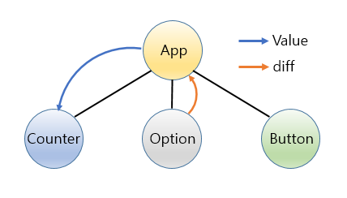
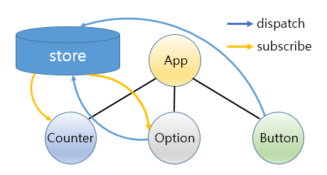

#### Redux 기본 원리
백성(React 컴포넌트)들은 임금님(Store)에게 직접 접근할 수 없고 궁궐 문지기(Reducer)에게 신문고를 두들기는 식으로 특별한 행동(Action)을 하여 자신의 뜻을 전달해야 합니다.

 

----------

#### redux를 안 쓴다면
 

#### redux를 쓴다면

#### React랑 React+Redux의 차이
- React는 React 컴포넌트 자신이 개별적으로 상태관리를 함
- React + Redux는 "상태관리를 하는 전용 장소(store)"에서 상태를 관리하고, React 컴포넌트는 그걸 보여주기만 하는 용도로 쓰임
https://medium.com/@ca3rot/%EC%95%84%EB%A7%88-%EC%9D%B4%EA%B2%8C-%EC%A0%9C%EC%9D%BC-%EC%9D%B4%ED%95%B4%ED%95%98%EA%B8%B0-%EC%89%AC%EC%9A%B8%EA%B1%B8%EC%9A%94-react-redux-%ED%94%8C%EB%A1%9C%EC%9A%B0%EC%9D%98-%EC%9D%B4%ED%95%B4-1585e911a0a6
-----------

 

#### Store
상태는 기본적으로 전부 여기서 집중관리됩니다.

    {
        value: 0,
    }

----------

 

#### Action 및 Action Creator

1. Store랑 Store에 존재하는 State는 아주 신성해서 직접 접근할 수 없습니다.
2. React 컴포넌트가 State에 접근하려면 Action이라는 의식을 거쳐야 합니다. (즉, Store에 대해 뭔가 하고 싶은 경우엔 Action을 발행합니다)
3. Store의 문지기가 Action의 발생을 감지하면, State가 경신됩니다.

 
기본형태

    {
        type: "액션의 종류를 한번에 식별할 수 있는 문자열 혹은 심볼",
        payload: "액션의 실행에 필요한 임의의 데이터",
    }

 
카운터의 값을 2배 늘리는 경우의 형태

    {
        type: "@@myapp/ADD_VALUE",
        payload: 2,
    }

 
실제로는 이런 식으로 사용합니다.

    export const ADD_VALUE = '@@myapp/ADD_VALUE';
    export const addValue = amount => ({type: ADD_VALUE, payload: amount});

-----

 

#### Reducer
Store의 문지기.
이전 상태와 Action을 합쳐, 새로운 state를 만드는 조작을 말합니다.

    import { ADD_VALUE } from './actions';
    ​
    // 초기 상태는 Reducer의 디폴트 인수에서 정의됩니다.
    export default (state = {value: 0}, action) => {

        switch (action.type) {
            case ADD_VALUE:
                return { ...state, value: state.value + action.payload };
        
            default:
                return state;
        }
    }

 
반환된 state는 store에 바로 반영되어 아래와 같이 변화합니다.

    {
        value: 2,
    }

 
##### 만약 문지기가 여러명일 경우

    import { combineReducers } from 'redux';
    ​
    const sessionReducer = (state = {loggedIn: false, user: null}, payload) => {
        어쩌고저쩌고
    };

    const timelineReducer = (state = {type: "home", statuses: []}, payload) => {
        어쩌고저쩌고
    };

    const notificationReducer = (state = [], payload) => {
        어쩌고저쩌고
    };
    ​
    export default combineReducers({
        session: sessionReducer,
        timeline: timelineReducer,
        notification: notificationReducer,
    })

 

----------

#### Connect

1. Component가 Store로부터 무언가 정보를 받는 경우 그걸 props를 통해 받습니다. 
props는 immutable(불변)합니다. 즉, 상태가 변경될 때마다 새로운 Component가 다시 만들어집니다.   

2. 이때, React의 Component가 Redux의 흐름에 타기 위해서는 ReactRedux에 의해 제공되는 connect라는 함수를 이용합니다.

 

##### connect의 동작

    1. mapStateToProps: Store가 가진 state를 어떻게 props에 엮을지 지정

    2. mapDispatchToProps: Reducer에 action을 알리는 함수 dispatch(문지기)를 어떻게 props에 엮을지 정합니다.

    3. 위 2가지가 적용된 props를 받을 Component를 정합니다.

    4. Store와 Reducer를 연결시킬 수 있도록 만들어진 Component가 반환값이 됩니다.
   
 

##### 예제1 (함수)      - 설명은 밑에서

    import React, { Component } from 'react';
    import { connect } from 'react-redux';
    import { addValue } from './actions';
    ​
    const Counter = ({ value, dispatchAddValue }) => (
        

            Value: {value}
            <a href="#" onClick={e => dispatchAddValue(1)}>+1</a>
            <a href="#" onClick={e => dispatchAddValue(2)}>+2</a>
        

    );
    ​
    export default connect(
        state => ({ value: state.value }),
        dispatch => ({ dispatchAddValue: amount => dispatch(addValue(amount)) })
    )(Counter)

 

##### 예제2 (클래스) - 설명은 밑에서
    import React, { Component } from 'react';
    import { connect } from 'react-redux';
    import { addValue } from './actions';
    ​
    class Counter extends Component {
        render() {
            const { value, dispatchAddValue } = this.props;
            return (
                

                    Value: {value}
                    <a href="#" onClick={e => dispatchAddValue(1)}>+1</a>
                    <a href="#" onClick={e => dispatchAddValue(2)}>+2</a>
                

            );
        }
    }
    ​
    export default connect(
        state => ({ value: state.value }),
        dispatch => ({ dispatchAddValue: amount => dispatch(addValue(amount)) })
    )(Counter)

  

##### 1. mapStateToprops
Store가 가진 state를 어떻게 props에 엮을지 지정합니다.
인수로 전달된 state는 전체를 의미한다는 것에 주의해야 합니다. 

카운터의 예를 다시 보면,

    {
        value: 2,
    }

...이것이   

    <Counter value={2} />
...로 들어가길 바라며   

    state => ({ value: state.value})
...라고 썼습니다.    

p.s.

    state => state
...라고 쓰지 않은 이유는 필요한 것만 선별해서 props로 엮기 위함이라고 하네요

  

##### 2. mapDispatchToProps
Reducer(임금님)에 action(저 백성이 세금 깎아달라고 요청합니다)을 알리는 함수 dispatch(궁궐 문지기)를 어떻게 props에 엮을지 정합니다.

(작성중)